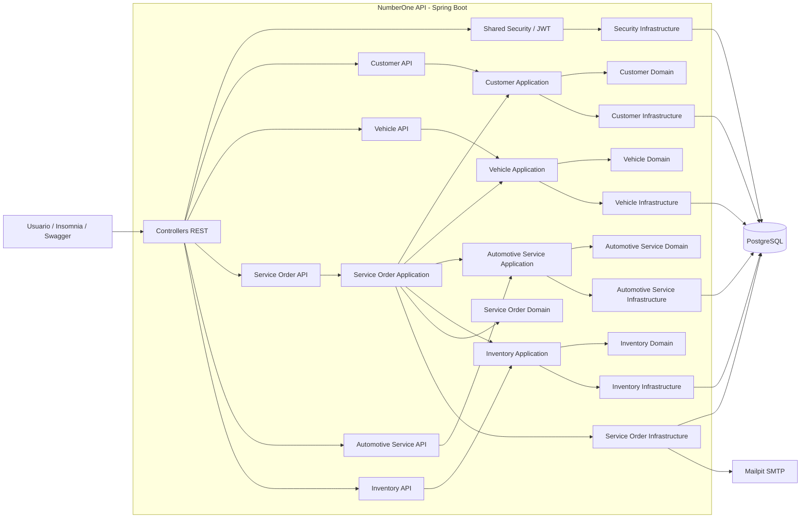
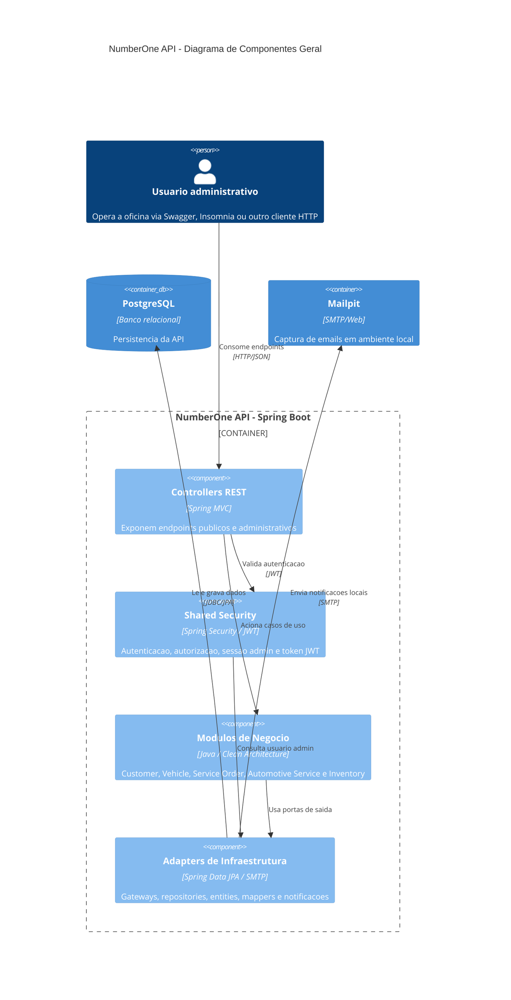
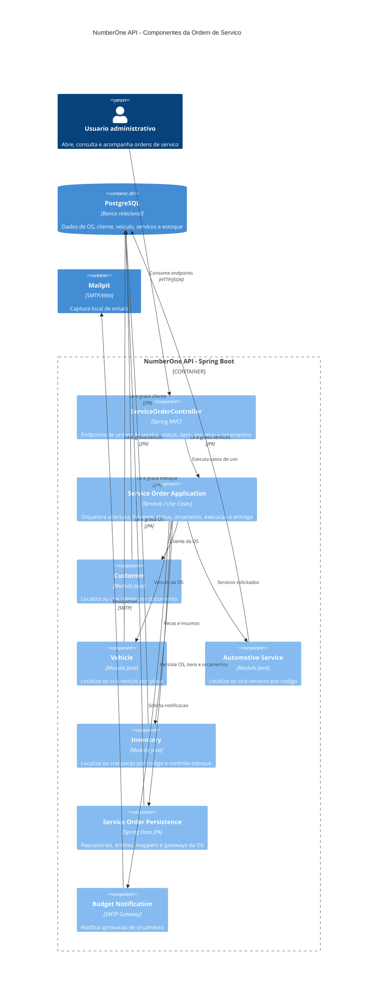

# Diagrama de Componentes

Este documento registra duas visoes do mesmo recorte arquitetural da aplicacao NumberOne:

- **Mermaid flowchart**: versao simples, estavel e facil de renderizar no GitHub.
- **C4 Component em Mermaid**: versao alinhada ao C4 Model, usando a API Spring Boot como container e os modulos internos como componentes.

O objetivo e documentar os componentes principais sem descer ao nivel de classes. Para detalhes de codigo, consulte os pacotes em `src/main/java/br/com/fiap/numberone`.

## Visao Mermaid

## Visao C4 Component - Geral

## Visao C4 Component - Ordem de Servico

## Como Ler

- `api`: camada de entrada HTTP. Contem controllers, DTOs, mappers e handlers de excecao.
- `application`: camada de casos de uso. Contem services, commands e gateways/ports.
- `domain`: regras de negocio, entidades, value objects, enums e excecoes do dominio.
- `infrastructure`: adapters de saida. Contem repositories, entities JPA, mappers, gateways e configuracoes de beans.
- `shared`: recursos transversais, como seguranca, configuracao, email, swagger e tratamento global.

## Observacoes

- O modulo `serviceorder` e o principal orquestrador de fluxo de negocio, pois depende de cliente, veiculo, servicos automotivos e estoque.
- O banco PostgreSQL e externo ao container da API no Kubernetes, com deployment e service proprios.
- O Mailpit tambem e externo a API e e usado para suporte local ao envio/captura de emails.
- A versao C4 geral reduz relacionamentos para privilegiar legibilidade.
- A versao C4 focada em Ordem de Servico mostra as dependencias do fluxo mais importante do sistema.
- Caso algum visualizador nao suporte a sintaxe C4 do Mermaid, use a versao Mermaid flowchart.
