# Fluxo de GitHub Actions

Este diagrama representa o fluxo local atual dos workflows do projeto:

- `CI`: valida build, testes unitarios e manifests Kubernetes.
- `CD Local - Banco de Dados`: aplica o overlay Kustomize do banco local e Mailpit.
- `CD Local - API`: gera/carrega a imagem Docker e aplica o overlay Kustomize da API local.

```mermaid
flowchart TD

    START([Push, Pull Request<br/>ou Workflow Dispatch])

    subgraph CI["Workflow: CI"]
        CI1[Checkout do codigo]
        CI2[Configurar Java 25]
        CI3[Validar projeto Maven]
        CI4[Build da aplicacao]
        CI5[Executar testes unitarios]
        CI6[Validar overlays Kustomize]
        CI7([CI validado])

        CI1 --> CI2
        CI2 --> CI3
        CI3 --> CI4
        CI4 --> CI5
        CI5 --> CI6
        CI6 --> CI7
    end

    subgraph DB["Workflow: CD Local - Banco de Dados"]
        DB1[Checkout do codigo]
        DB2[Validar acesso ao cluster Kubernetes]
        DB3[Aplicar overlay Kustomize local/database]
        DB4{Rollout PostgreSQL concluido?}
        DB5{Rollout Mailpit concluido?}
        DB6[Evidenciar recursos]
        DB7([Banco de dados disponivel])

        DB1 --> DB2
        DB2 --> DB3
        DB3 --> DB4
        DB4 -->|Sim| DB5
        DB4 -->|Nao| DB3
        DB5 -->|Sim| DB6
        DB5 -->|Nao| DB3
        DB6 --> DB7
    end

    subgraph API["Workflow: CD Local - API"]
        API1[Checkout do codigo]
        API2[Validar Docker e estrategia local]
        API3[Build da imagem Docker]
        API4{Minikube disponivel?}
        API5[Carregar imagem no Minikube]
        API6[Prosseguir utilizando Docker local]
        API7[Validar acesso ao cluster]
        API8[Aguardar PostgreSQL disponivel]
        API9[Aplicar overlay Kustomize local/api]
        API10[Atualizar deployment com nova imagem]
        API11{Rollout da API concluido?}
        API12[Evidenciar deploy]
        API13([API disponivel])

        API1 --> API2
        API2 --> API3
        API3 --> API4
        API4 -->|Sim| API5
        API4 -->|Nao| API6
        API5 --> API7
        API6 --> API7
        API7 --> API8
        API8 --> API9
        API9 --> API10
        API10 --> API11
        API11 -->|Sim| API12
        API11 -->|Nao| API9
        API12 --> API13
    end

    START --> CI1
    CI7 --> DB1
    DB7 --> API1

    END([Deploy local finalizado])

    API13 --> END
```

