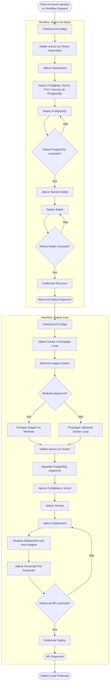

## Fluxo de Deploy Local

```mermaid
flowchart TD

    START([Push na branch develop<br/>ou Workflow Dispatch])

    %% =========================
    %% DATABASE
    %% =========================

    subgraph DB["Workflow: Banco de dados"]

        DB1[Checkout do Código]
        DB2[Validar acesso ao Cluster Kubernetes]
        DB3[Aplicar Namespace]
        DB4[Aplicar ConfigMap, Secret, PVC e Service do PostgreSQL]
        DB5[Deploy PostgreSQL]
        DB6{Rollout PostgreSQL concluído?}
        DB7[Aplicar Service Mailpit]
        DB8[Deploy Mailpit]
        DB9{Rollout Mailpit concluído?}
        DB10[Evidenciar Recursos]
        DB11([Banco de Dados Disponível])

        DB1 --> DB2
        DB2 --> DB3
        DB3 --> DB4
        DB4 --> DB5
        DB5 --> DB6
        DB6 -->|Sim| DB7
        DB6 -->|Não| DB5
        DB7 --> DB8
        DB8 --> DB9
        DB9 -->|Sim| DB10
        DB9 -->|Não| DB8
        DB10 --> DB11

    end

    %% =========================
    %% API
    %% =========================

    subgraph API["Workflow: Deploy local"]

        API1[Checkout do Código]
        API2[Validar Docker e Estratégia Local]
        API3[Build da Imagem Docker]
        API4{Minikube disponível?}
        API5[Carregar imagem no Minikube]
        API6[Prosseguir utilizando Docker Local]
        API7[Validar acesso ao Cluster]
        API8[Aguardar PostgreSQL disponível]
        API9[Aplicar ConfigMap e Secret]
        API10[Aplicar Service]
        API11[Aplicar Deployment]
        API12[Atualizar Deployment com nova imagem]
        API13[Aplicar Horizontal Pod Autoscaler]
        API14{Rollout da API concluído?}
        API15[Evidenciar Deploy]
        API16([API Disponível])

        API1 --> API2
        API2 --> API3
        API3 --> API4
        API4 -->|Sim| API5
        API4 -->|Não| API6
        API5 --> API7
        API6 --> API7
        API7 --> API8
        API8 --> API9
        API9 --> API10
        API10 --> API11
        API11 --> API12
        API12 --> API13
        API13 --> API14
        API14 -->|Sim| API15
        API14 -->|Não| API11
        API15 --> API16

    end

    START --> DB1
    DB11 --> API1

    END([Deploy Local Finalizado])

    API16 --> END
```
