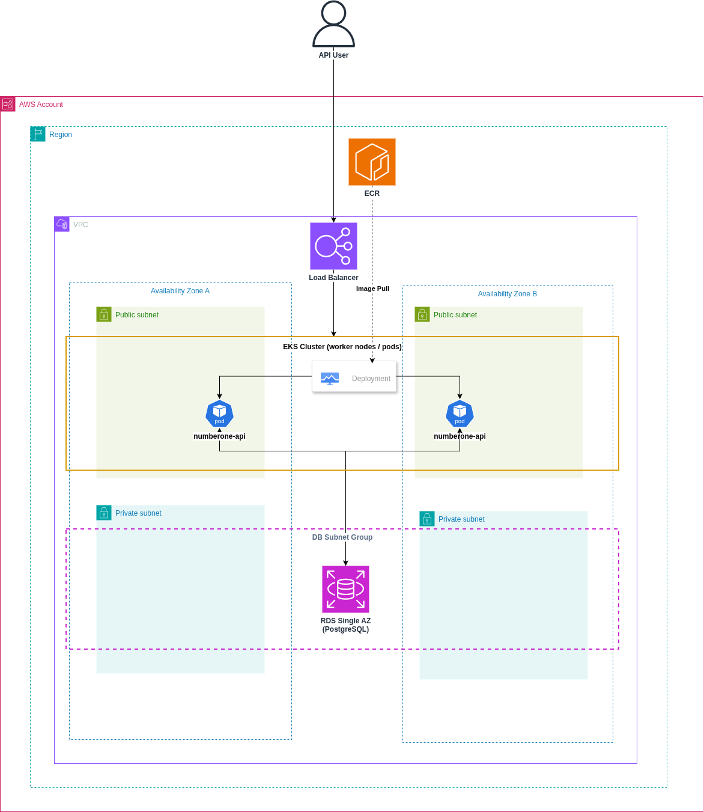

# Infraestrutura AWS - NumberOne

Este diretório contém toda a infraestrutura como código (IaC) do projeto **NumberOne**, utilizando **Terraform** para provisionar os recursos na AWS.

## Arquitetura

### Visão Geral



## Estrutura

```text
infra/
├── bootstrap/
├── diagrams/
├── modules/
│   ├── ecr/
│   ├── eks/
│   ├── rds/
│   └── vpc/
├── scripts/
├── backend.tf
├── data.tf
├── locals.tf
├── main.tf
├── outputs.tf
├── providers.tf
├── terraform.tfvars
├── variables.tf
└── versions.tf
```

---

## Módulos

| Módulo | Descrição |
|---------|-----------|
| `vpc` | Provisiona a VPC, subnets públicas e privadas, Internet Gateway e Route Tables. |
| `eks` | Provisiona o cluster Amazon EKS e o Managed Node Group. |
| `rds` | Provisiona a instância PostgreSQL utilizada pela aplicação. |
| `ecr` | Provisiona o repositório Amazon ECR para armazenamento das imagens Docker. |

Cada módulo possui sua própria documentação em `modules/<nome>/README.md`.

---

## Recursos Provisionados

- Amazon VPC
- Public Subnets
- Private Subnets
- Internet Gateway
- Route Tables
- Security Groups
- Amazon EKS
- Amazon EKS Managed Node Group
- Amazon RDS PostgreSQL (Single AZ)
- Amazon ECR
- Backend remoto do Terraform (Amazon S3)

---

## Variáveis Principais

As configurações do ambiente são definidas em:

```text
terraform.tfvars
```

Principais variáveis:

| Variável | Descrição |
|----------|-----------|
| `project_name` | Nome do projeto utilizado nos recursos. |
| `aws_region` | Região da AWS. |
| `vpc_cidr` | CIDR da VPC. |
| `availability_zones` | Zonas de disponibilidade utilizadas. |
| `public_subnets` | CIDRs das subnets públicas. |
| `private_subnets` | CIDRs das subnets privadas. |
| `enable_nat_gateway` | Habilita ou desabilita NAT Gateway. |
| `cluster_role_name` | Nome da IAM Role do Cluster EKS. |
| `node_role_name` | Nome da IAM Role dos Nodes. |
| `kubernetes_version` | Versão do Kubernetes. |
| `db_name` | Nome do banco PostgreSQL. |
| `db_username` | Usuário do banco. |
| `db_password` | Senha do banco. |
| `db_instance_class` | Classe da instância RDS. |
| `db_allocated_storage` | Tamanho do armazenamento do banco. |

---

## Outputs

Os principais recursos provisionados são exportados através do arquivo `outputs.tf`.

| Output | Descrição |
|---------|-----------|
| `vpc_id` | ID da VPC. |
| `public_subnet_ids` | IDs das subnets públicas. |
| `private_subnet_ids` | IDs das subnets privadas. |
| `cluster_name` | Nome do cluster Amazon EKS. |
| `aws_region` | Região utilizada. |
| `rds_endpoint` | Endpoint do PostgreSQL. |
| `rds_port` | Porta do PostgreSQL. |
| `ecr_repository_name` | Nome do repositório ECR. |
| `ecr_repository_url` | URL do repositório ECR. |

Esses outputs são utilizados automaticamente pelos scripts de deploy localizados em `scripts/`.

---

## Fluxo de Provisionamento

```text
terraform init
        │
terraform plan
        │
terraform apply
        │
        ▼
VPC
        │
        ├── Public Subnets
        ├── Private Subnets
        └── Security Groups
                │
                ├── Amazon EKS
                ├── Amazon RDS
                └── Amazon ECR
```

---

## Como Executar

Execute todos os comandos a partir da pasta:

```text
infra/
```

Inicializar o projeto:

```bash
terraform init
```

Validar:

```bash
terraform validate
```

Visualizar alterações:

```bash
terraform plan
```

Provisionar a infraestrutura:

```bash
terraform apply
```

Destruir a infraestrutura:

```bash
terraform destroy
```

---

## Deploy da Aplicação

Após a infraestrutura ser criada, o deploy da aplicação pode ser realizado utilizando o script:

```bash
./scripts/deploy-aws.sh
```

O script executa automaticamente:

- Terraform Apply
- Atualização do kubeconfig
- Login no Amazon ECR
- Build da imagem Docker
- Push da imagem
- Aplicação dos manifests Kubernetes
- Validação do deployment

---

## Estrutura dos Scripts

```text
scripts/
├── deploy-aws.sh
└── destroy-aws.sh
```

| Script | Descrição |
|---------|-----------|
| `deploy-aws.sh` | Provisiona a infraestrutura e realiza o deploy da aplicação no Amazon EKS. |
| `destroy-aws.sh` | Remove os recursos Kubernetes e destrói a infraestrutura provisionada pelo Terraform. |

---

## Documentação Complementar

- Kubernetes: [`../.k8s/README.md`](../.k8s/README.md)
- VPC: [`modules/vpc/README.md`](modules/vpc/README.md)
- Amazon EKS: [`modules/eks/README.md`](modules/eks/README.md)
- Amazon RDS: [`modules/rds/README.md`](modules/rds/README.md)
- Amazon ECR: [`modules/ecr/README.md`](modules/ecr/README.md)