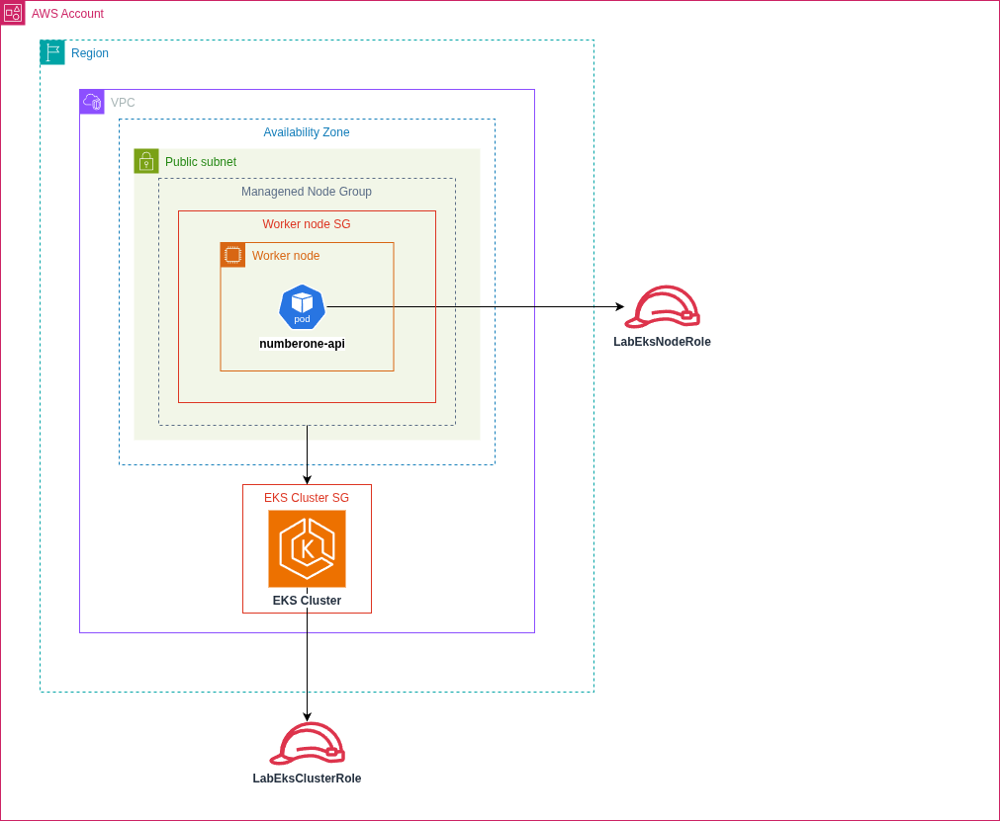

# Módulo EKS

Responsável por provisionar o cluster Kubernetes utilizado pela aplicação NumberOne.

## Arquitetura



## Recursos Criados

O módulo cria os seguintes recursos:

- Amazon EKS Cluster
- Managed Node Group
- Security Group do Cluster
- Security Group dos Nodes
- Regras de comunicação entre Cluster e Nodes

---

## Estrutura

```text
modules/eks/
├── main.tf
├── variables.tf
├── outputs.tf
└── README.md
```

---

## Variáveis

| Variável | Descrição |
|----------|-----------|
| `cluster_name` | Nome do cluster |
| `kubernetes_version` | Versão do Kubernetes |
| `vpc_id` | VPC onde o cluster será criado |
| `subnet_ids` | Subnets utilizadas pelo cluster |
| `cluster_role_arn` | IAM Role do Cluster |
| `node_role_arn` | IAM Role dos Nodes |
| `node_group` | Configuração do Managed Node Group |

---

## Outputs

| Output | Descrição |
|----------|-----------|
| `cluster_name` | Nome do cluster |
| `cluster_endpoint` | Endpoint da API |
| `cluster_certificate_authority` | Certificado do cluster |
| `node_security_group_id` | Security Group dos Nodes |

---

## Fluxo

```text
VPC
    │
Subnets
    │
Security Groups
    │
EKS Cluster
    │
Managed Node Group
```

---

## Exemplo de Utilização

```hcl
module "eks" {
  source = "./modules/eks"

  cluster_name       = "${var.project_name}-eks"
  kubernetes_version = var.kubernetes_version

  vpc_id     = module.vpc.vpc_id
  subnet_ids = module.vpc.public_subnet_ids

  cluster_role_arn = data.aws_iam_role.cluster.arn
  node_role_arn    = data.aws_iam_role.node.arn

  node_group = var.node_group
}
```

---

## Observações

- O cluster é criado utilizando subnets públicas.
- Os Managed Nodes são distribuídos entre as Availability Zones configuradas.
- O Kubernetes cria automaticamente o Load Balancer da aplicação quando um Service do tipo `LoadBalancer` é aplicado.