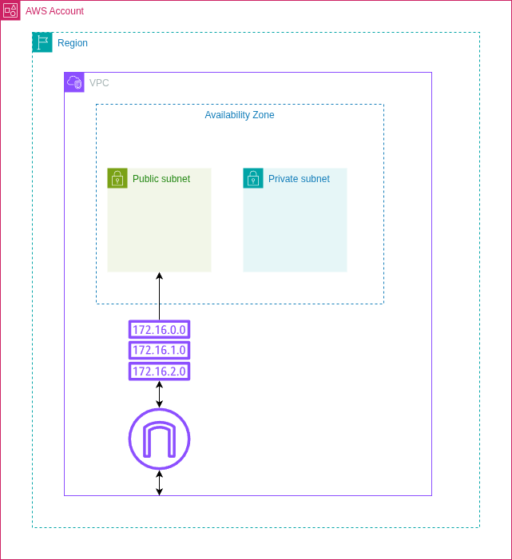

# Módulo VPC

Responsável por provisionar toda a infraestrutura de rede utilizada pelo projeto NumberOne na AWS.

## Arquitetura



## Recursos Criados

O módulo cria os seguintes recursos:

- VPC
- Subnets Públicas
- Subnets Privadas
- Internet Gateway
- Route Tables
- Route Table Associations

> Atualmente o projeto utiliza apenas Internet Gateway. O uso de NAT Gateway pode ser habilitado futuramente através da variável `enable_nat_gateway`.

---

## Estrutura

```text
modules/vpc/
├── main.tf
├── variables.tf
├── outputs.tf
└── README.md
```

---

## Variáveis

| Variável | Descrição |
|----------|-----------|
| `project_name` | Nome do projeto utilizado nos recursos |
| `vpc_cidr` | CIDR da VPC |
| `availability_zones` | Zonas de disponibilidade utilizadas |
| `public_subnets` | Lista de CIDRs das subnets públicas |
| `private_subnets` | Lista de CIDRs das subnets privadas |
| `enable_nat_gateway` | Habilita ou não NAT Gateway |

---

## Outputs

| Output | Descrição |
|----------|-----------|
| `vpc_id` | ID da VPC |
| `public_subnet_ids` | IDs das subnets públicas |
| `private_subnet_ids` | IDs das subnets privadas |

---

## Fluxo

```text
VPC
        │
        ├──────────────┐
        │              │
 Public Subnets   Private Subnets
        │              │
        └──────┬───────┘
               │
        Route Tables
               │
       Internet Gateway
```

---

## Exemplo de Utilização

```hcl
module "vpc" {
  source = "./modules/vpc"

  project_name       = var.project_name
  vpc_cidr           = var.vpc_cidr
  availability_zones = var.availability_zones

  public_subnets     = var.public_subnets
  private_subnets    = var.private_subnets

  enable_nat_gateway = var.enable_nat_gateway
}
```

---

## Observações

- As subnets públicas são utilizadas pelos Load Balancers e Nodes do EKS.
- As subnets privadas são utilizadas pelo Amazon RDS.
- O módulo foi desenvolvido para ser reutilizável em diferentes projetos apenas alterando as variáveis de entrada.